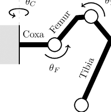
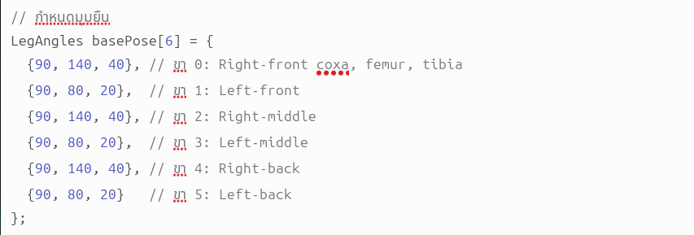

 
 

code ส่วนอื่นไว้setแต่ละขาและก็แปลงมุมไม่สําคัญแต่สงสัยถามได้
 
<table border="1" cellpadding="5" cellspacing="0">
    <thead>
        <tr>
            <th>Leg</th>
            <th>Coxa</th>
            <th>Femur</th>
            <th>Tibia</th>
        </tr>
    </thead>
    <tbody>
        <tr>
            <td>Right Front</td>
            <td>PCA 2</td>
            <td>PCA 1</td>
            <td>PCA 0</td>
        </tr>
        <tr>
            <td>Left Front</td>
            <td>PCA 5</td>
            <td>PCA 4</td>
            <td>PCA 3</td>
        </tr>
        <tr>
            <td>Right Middle</td>
            <td>PCA 11</td>
            <td>PCA 10</td>
            <td>PCA 9</td>
        </tr>
        <tr>
            <td>Left Middle</td>
            <td>PCA 8</td>
            <td>PCA 7</td>
            <td>PCA 6</td>
        </tr>
        <tr>
            <td>Right Back</td>
            <td>PCA 15</td>
            <td>D4</td>
            <td>D3</td>
        </tr>
        <tr>
            <td>Left Back</td>
            <td>PCA 14</td>
            <td>PCA 13</td>
            <td>PCA 12</td>
        </tr>
    </tbody>
</table>
